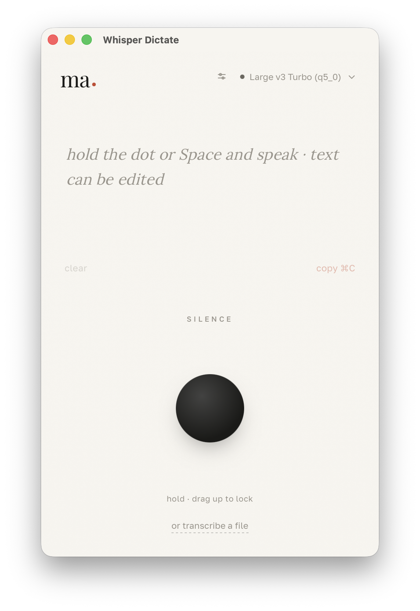
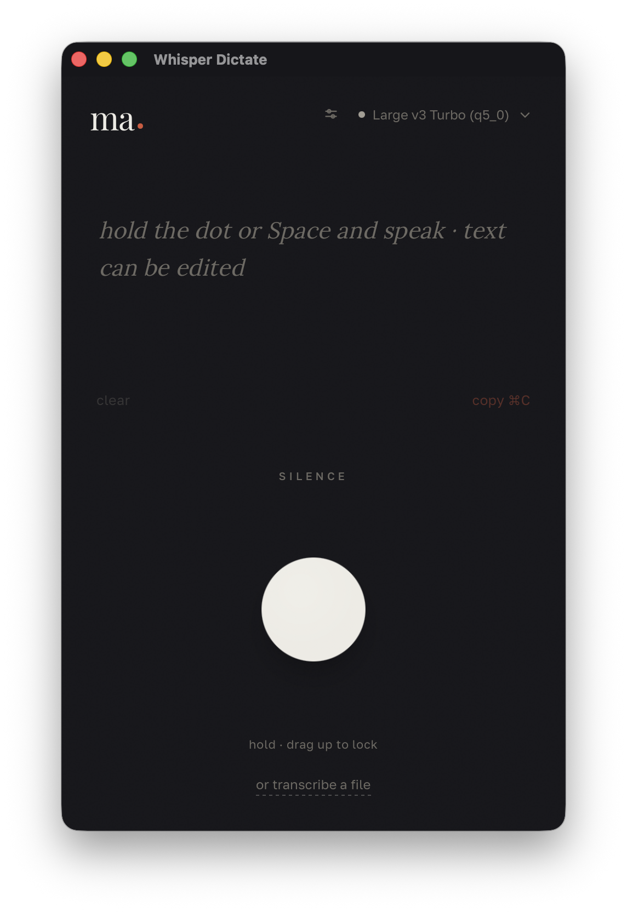

# Whisper Dictate

> [English version](README.md)

Офлайн-приложение для диктовки и расшифровки файлов: говоришь → видишь транскрипт → копируешь в буфер.
Распознавание полностью локальное ([Whisper](https://github.com/openai/whisper)) — аудио никуда не отправляется.

- **Платформы:** macOS 11+ (Metal GPU) · Windows (Vulkan GPU, CPU fallback)
- **Стек:** Tauri 2 (Rust) + React 19 + TypeScript + Vite
- **STT:** [whisper-rs](https://github.com/tazz4843/whisper-rs) (биндинги к whisper.cpp)
- **GPU:** Metal на macOS · Vulkan на Windows (автоматический fallback на CPU без GPU)
- **Модель по умолчанию:** `large-v3-turbo` q5_0 (~570 МБ), опционально `large-v3`
- **Дизайн:** эстетика «ма» (間) — бумага и тушь, киноварный акцент
- **Язык интерфейса:** определяется автоматически по локали ОС (EN / RU), переключается в приложении

## Скачать

Готовые бинарники — на странице [Releases](https://github.com/MrRefactoring/whisper-dictate/releases):
- **macOS:** `.dmg` (universal — Intel + Apple Silicon)
- **Windows:** `.msi` / `.exe`

Приложение само уведомит об обновлениях при запуске.

## Скриншоты

| Светлая тема | Тёмная тема |
|---|---|
|  |  |

> Скриншоты появятся в ближайшее время. Чтобы добавить — запустите приложение и положите изображения в `docs/`.

## Сборка из исходников

### macOS

```bash
# Требования: Node + pnpm, Rust, Xcode CLI Tools, CMake
brew install cmake

pnpm install
pnpm app          # dev-запуск (первый билд Rust+whisper.cpp — долгий)
pnpm app:build    # прод-сборка → src-tauri/target/release/bundle/
```

При первом запуске macOS попросит доступ к микрофону.

### Windows

```bash
# Требования: Node + pnpm, Rust (MSVC), Visual Studio C++ tools, CMake
pnpm install
pnpm app
```

## Команды

| Команда | Что делает |
|---|---|
| `pnpm app` | Dev-запуск |
| `pnpm app:build` | Прод-сборка (`.app` + `.dmg` / `.msi`) |
| `pnpm app:dmg` | Только `.dmg` (macOS) |
| `pnpm model` | Скачать `large-v3-turbo` вручную |
| `pnpm model:large` | Скачать `large-v3` (максимальное качество) |

## Использование

**Диктовка (push-to-talk):** удерживай точку или пробел → запись; тяни вверх → фиксация (hands-free) до явного завершения.

**Расшифровка файла:** перетащи аудио/видео в окно или нажми «расшифровать файл».

Поддерживаемые форматы: mp3, m4a, aac, wav, flac, ogg, opus, mp4, mov, mkv, webm и другие.

**Язык интерфейса:** приложение автоматически определяет локаль ОС и переключается между английским и русским. Переключить вручную можно кнопкой `en · ru` в правом верхнем углу.

## Архитектура

```
src-tauri/src/
  audio.rs         — захват микрофона (cpal), downmix → mono, ресемпл до 16 kHz
  vad.rs           — энергетический VAD (RMS) для уровня и тишины
  transcription.rs — whisper-rs; Metal GPU на macOS, CPU на Windows
  decode.rs        — декодирование аудио/видео файлов (symphonia)
  loop_detect.rs   — детекция зациклованного аудио в видеофайлах
  model_manager.rs — выбор/поиск/докачка ggml-моделей
  engine.rs        — поток-воркер: конечный автомат записи + гибридный режим
  commands.rs      — Tauri-команды (start/stop/lock/transcribe_file…)
  lib.rs           — сборка приложения, плагины, регистрация команд

src/
  i18n/             — переводы (EN/RU), контекст и хук языка
  hooks/
    useDictation.ts — все события/стейт диктовки
    useUpdater.ts   — проверка обновлений при старте
  components/       — MicButton, InkWave, TranscriptPanel, ModelPicker, LangSwitch, Toast
```

## Лицензия

MIT © 2026 Vladislav Tupikin
